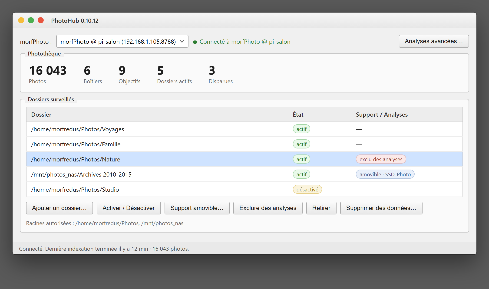

# PhotoHub

*Lire dans une autre langue : [English](README.md) · **Français** (ce document).*

[](CHANGELOG.md)


**PhotoHub est l'application desktop du domaine photo.** C'est un **client pur** de
morfPhoto : il ne lit jamais les fichiers, ne lance jamais ExifTool, ne connaît pas
SQLite. Il trouve morfPhoto sur le réseau local par sa **capacité** morfBeacon
(`photo_index`) - aucune adresse codée en dur - et dialogue avec son contrat HTTP
`/api/v1`.

## Aperçu



*Capture d'illustration : la source morfPhoto sélectionnée, les statistiques de la
photothèque, et les dossiers surveillés avec leur état (support amovible, exclusion
des analyses). Les valeurs, chemins et hôtes sont des **données d'exemple
anonymisées**.*

## Architecture de déploiement type

```
Windows (poste de travail)          Linux ARM64 (Raspberry Pi)
─────────────────────────           ──────────────────────────
C:\Users\frede\Pictures\  ←── Samba/SMB ───→  /mnt/photos_<hostname>/   (montage en lecture)
                                               morfPhoto       (indexeur, API HTTP)
PhotoHub  ──────────────────── HTTP /api/v1 ──→ morfPhoto
```

- Les **photos restent sur Windows**, jamais déplacées ni modifiées par morfPhoto.
- morfPhoto monte le partage Samba **en lecture seule** et n'écrit jamais dans les
  dossiers Windows.
- PhotoHub tourne sur Windows et utilise un **mappage de chemins**
  (`Fichier > Mappage de chemins…`) pour traduire les chemins locaux Windows
  (`C:\Users\frede\Pictures\…`) en chemins de montage Linux (`/mnt/photos_<hostname>/…`)
  avant de les envoyer à l'API de morfPhoto.

## Mettre en place l'accès (assistant)

morfPhoto indexe des **chemins locaux à la machine où il tourne** (son champ `roots`).
Selon l'endroit où il tourne, l'accès aux photos se prépare différemment. L'**Assistant
d'accès réseau** (`Fichier > Assistant d'accès réseau…`) part d'un choix de situation et
adapte les étapes. Il couvre trois cas :

- **Un serveur Linux (Raspberry Pi ou autre), photos partagées depuis ce PC.** Il crée
  le **partage Windows en lecture seule** en un clic (autorisation administrateur / UAC)
  et **envoie la configuration** à morfPhoto, qui monte `//IP/partage` sous
  `/mnt/photos_<hostname>` avec un fichier d'identifiants dédié. Les commandes
  serveur équivalentes restent générées (nom du PC, IP, compte, nom de partage).
- **Ce PC Windows (morfPhoto et les photos sur la même machine).** Aucun partage, aucun
  montage : l'assistant donne le bloc `roots` à mettre dans `morfphoto.json` avec le
  dossier local (en slashs avant). Aucun mappage de chemins n'est alors nécessaire.
- **Un autre PC Windows, photos partagées depuis ce PC.** Il crée le partage ici, puis
  donne la **racine UNC** (`//NOM-DU-PC/partage`) à déclarer dans le `roots` de la machine
  morfPhoto — sans montage. Le compte qui exécute le service morfPhoto doit avoir accès au
  partage.

Pour les cas avec partage SMB depuis Linux, il faut le **nom d'utilisateur
Windows de cette machine** (pas l'adresse e-mail) et le mot de passe adapté :

- **compte local** : mot de passe de session Windows ;
- **compte lié à Microsoft** : mot de passe du compte Microsoft associé.

Un PIN Windows Hello, une empreinte, la reconnaissance faciale ou une passkey
ne fonctionnent pas pour le réseau. Windows refuse un mot de passe vide. Il
n'est pas nécessaire de créer un compte local dédié. Le détail, les erreurs
(`STATUS_ACCOUNT_LOCKED_OUT`, etc.) et la topologie validée (plusieurs PhotoHub
Windows, un seul morfPhoto sur le Pi) sont dans la notice du dépôt morfSystem :
[PHOTOS-SOURCES-RESEAU](https://github.com/morfredus/morfSystem/blob/main/docs/PHOTOS-SOURCES-RESEAU.md).
Le partage reste **en lecture seule**. Dans tous les cas,
**exiftool** doit être installé sur la machine morfPhoto (sinon les fichiers
sont indexés mais les métadonnées EXIF restent vides).

Pendant une indexation, PhotoHub n'affiche qu'une ligne d'état et une barre de
pourcentage. Le détail de la passe (connus, ajoutés, erreurs) revient quand la
barre disparaît, comme bilan.

## Ce qu'il fait

- **Découvre morfPhoto** par capacité sur le réseau local (heartbeats UDP).
- **Gère les dossiers surveillés** : déclarer un dossier, l'activer/désactiver, le
  retirer (retrait doux qui conserve l'historique - les fichiers passent absents,
  jamais supprimés).
- **Pilote l'indexation** : lancer une passe incrémentale ou complète et suivre son
  état.
- **Montre la photothèque d'un coup d'œil** : photos présentes, boîtiers, objectifs,
  dossiers actifs, fichiers disparus, et le résultat de la dernière passe.
- **Mappage de chemins** (`Fichier > Mappage de chemins…`) : traduit automatiquement
  les chemins Windows en chemins serveur Linux. Configuré une seule fois, persisté
  dans les préférences Windows (registre).
- **Assistant d'accès réseau** (`Fichier > Assistant d'accès réseau…`) : crée le
  partage Windows en lecture seule et génère les commandes de montage du Pi (voir
  la section dédiée ci-dessus).
- **Enrichissement optionnel** : si un service annonce la capacité `photo_analytics`
  (morfAnalytics), un bouton ouvre l'analyse Photo avancée. Aucune dépendance forte :
  PhotoHub fonctionne seul.

morfPhoto refuse (403) tout dossier hors des racines autorisées déclarées dans sa
propre configuration ; PhotoHub ne fait que relayer ce message.

## Compiler

Nécessite **Qt 6** (Widgets, Network). Aucune autre dépendance.

```sh
cmake --preset mingw        # ou linux / linux-arm64
cmake --build --preset mingw
```

## Lancer

```sh
./build-mingw/PhotoHub.exe   # Windows ; ./build/PhotoHub sous Linux
```

Le lancer sur un réseau où une instance morfPhoto s'annonce : elle apparaît
automatiquement dans la liste des sources.

## Licence

GPL-3.0-only - © 2026 morfredus (Frédéric Biron).
